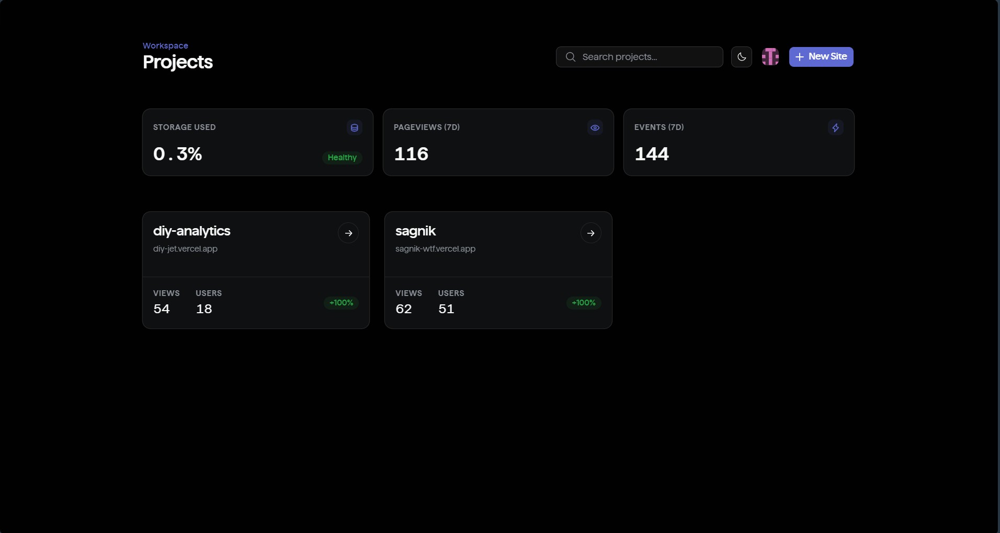
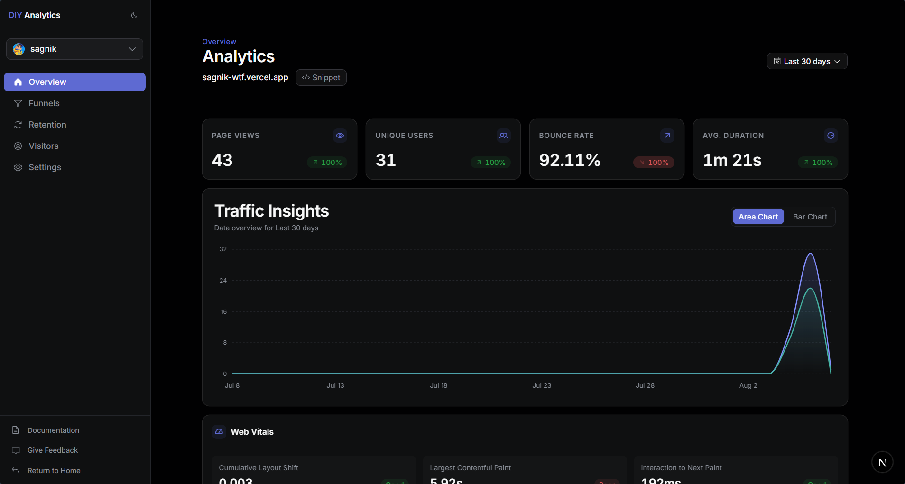
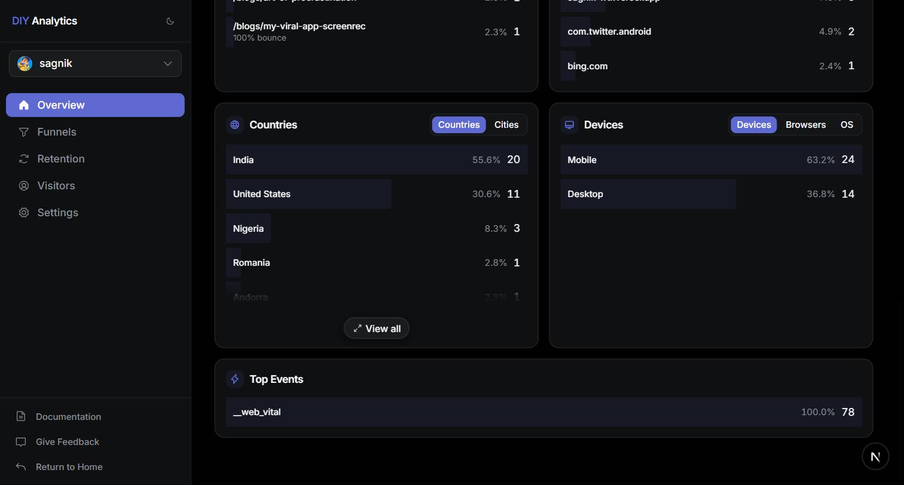
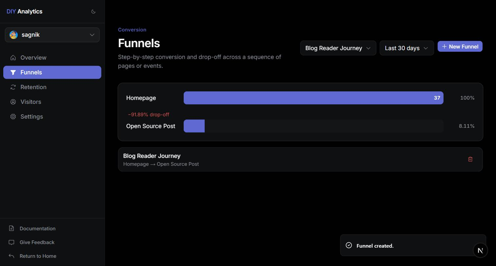
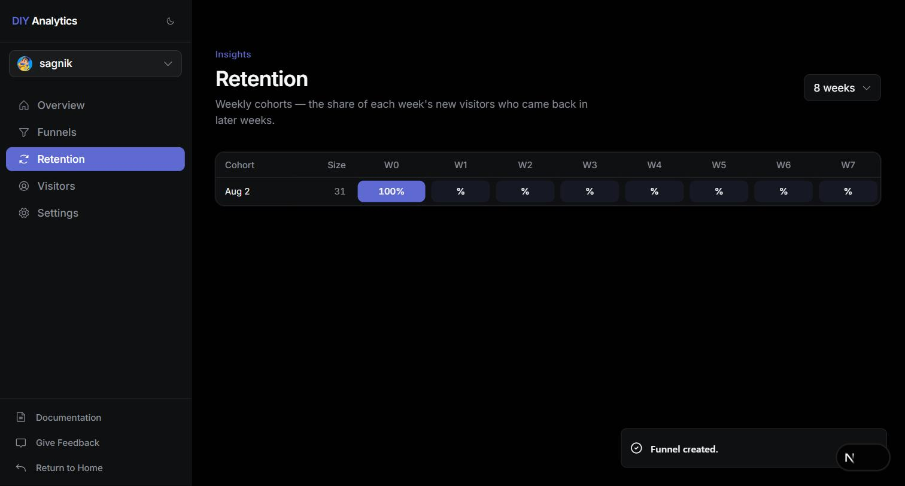
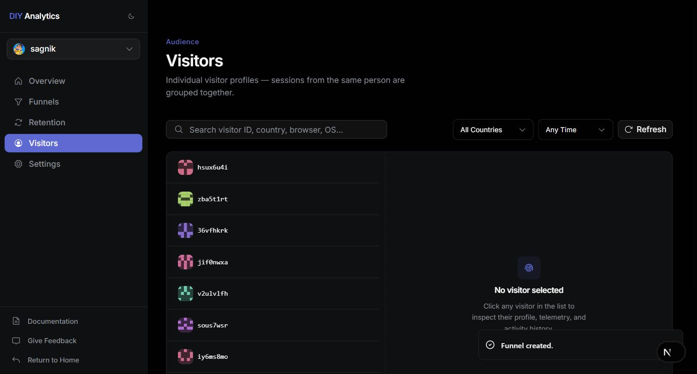
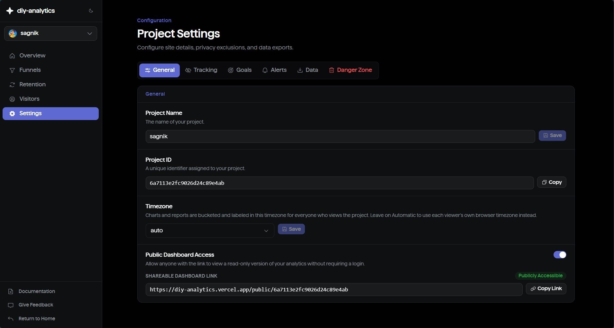

# Features

A detailed reference for everything in the dashboard. For installing the
tracking script, see the [Integration Guide](integration.md). For querying
data programmatically — including from an AI assistant — see
[MCP server & API keys](#mcp-server--api-keys).

## How this is organized

Everything lives under a **workspace**. A workspace holds one or more
**projects** (one project per site you track), and each project has its own
sidebar with eight tabs:

**Overview · Explore · Funnels · Journeys · Retention · Errors · Visitors ·
Settings**

This document walks through those tabs in that order, then covers the
cross-cutting stuff that isn't a tab of its own — goals, alerts, public
dashboards, workspace roles, and the MCP server. If you're looking for how
a specific screen behaves, match it to the sidebar label above and jump to
that section.

## Contents

- [Overview dashboard](#overview-dashboard)
  - [Date ranges](#date-ranges)
  - [Filters and click-to-filter](#filters-and-click-to-filter)
  - [Breakdown panels](#breakdown-panels)
  - [Live visitors](#live-visitors)
  - [Custom events](#custom-events)
  - [Web Vitals](#web-vitals)
- [Explore](#explore)
- [Funnels](#funnels)
- [Journeys](#journeys)
- [Retention](#retention)
- [Errors](#errors)
- [Visitors: Directory & Segments](#visitors-directory--segments)
- [Goals](#goals)
- [Alerts](#alerts)
- [Public dashboards](#public-dashboards)
- [Workspaces and roles](#workspaces-and-roles)
- [Project settings](#project-settings)
- [MCP server & API keys](#mcp-server--api-keys)
- [In-app AI chat assistant](#in-app-ai-chat-assistant)
- [Data export](#data-export)

## Overview dashboard

The main project page (`/[workspaceSlug]/projects/[projectId]`) is the
first thing you see for a project. It shows:

- **Core metrics** — page views, unique users, sessions, bounce rate, and
  average session duration, each with a percent change against the prior
  equivalent period.
- **A time-series chart** for page views, users, and sessions, bucketed at a
  granularity chosen automatically from the selected range (minute, hour,
  day, week, or month) so the chart stays readable whether you're looking at
  the last hour or the last year.

Unique users are identified by a persistent anonymous ID when available,
falling back to the session ID. The tracking script rotates the session ID
after 20 minutes of inactivity — a page visibility change, click, keypress,
or scroll all count as activity.

### Date ranges

Available presets: Last Hour, Last 24 hours, Last 7 days, Last 30 days, Last
6 months, Last 12 months, and All Time (from the project's creation date,
capped at 60 months back). A custom range is also available via a start/end
date picker.

Not every page offers the full preset list. Explore, Journeys, and Segments
each restrict the picker to a smaller, page-specific set, noted in their own
sections below — those views are more expensive to compute than the main
overview chart, so the range is deliberately kept shorter.

Every project has a **reporting timezone**, set in Settings. If set, all
viewers see the same time buckets regardless of their own browser timezone;
if unset, each viewer sees data bucketed in their own local timezone.

### Filters and click-to-filter

Clicking a row in most breakdown panels — a specific country, browser, page,
source, and so on — scopes the entire dashboard to that value. Every panel,
including the core metrics chart, re-queries under the new filter. Active
filters appear as removable chips above the dashboard, and multiple filters
combine as AND conditions. Filterable dimensions: country, browser, device,
OS, city, traffic source, page path, and UTM source/medium/campaign.

### Breakdown panels

- **Top Pages** — most-viewed paths, with per-page bounce rate and average
  time on page.
- **Entry / Exit Pages** — which pages sessions most often start and end on.
- **Sources** — referring domains, with `Direct` for traffic with no
  referrer.
- **Campaigns** — grouped by `utm_campaign`.
- **UTM Breakdown** — combined `utm_source` / `utm_medium` / `utm_campaign`
  view for sessions with UTM parameters.
- **Countries** and **Cities** — geolocated from the visitor's IP at ingest
  time (best-effort; city/region depend on your hosting platform providing
  geo headers).
- **Browsers**, **Operating Systems**, and **Devices** — parsed from the
  user agent, each with a version/model breakdown for the top values (e.g.
  which Chrome versions, which device models).
- **Top Events** — most-fired custom events, with click-through to a
  per-event property drill-down (see below).

Each panel shows a capped number of rows by default, with a "View all"
expansion for the full ranked list.

### Live visitors

A live count of distinct sessions active in the last 5 minutes, polled every
10 seconds. Shown as a pill near the top of the dashboard, hidden entirely
when the count is zero.

### Custom events

Any event sent via `window.trackEvent(name, data)` (see the
[Integration Guide](integration.md#5-custom-events)) appears in the Top
Events panel. Clicking an event opens a drill-down showing:

- The distinct property keys observed on that event's data payload (scalar
  values only — arrays and nested objects are excluded from breakdowns).
- The value distribution for a selected property key, with counts and
  unique-user counts per value.

This lets you answer questions like "which `plan` values are most common on
`signup_completed`" without predefining the property ahead of time.

### Web Vitals

Largest Contentful Paint (LCP), Cumulative Layout Shift (CLS), and
Interaction to Next Paint (INP) are collected automatically by the tracking
script — no configuration needed. The panel shows the 75th percentile for
each metric over the selected range, rated Good / Needs Improvement / Poor
against the same thresholds Google uses for Core Web Vitals:

| Metric | Good | Poor |
| --- | --- | --- |
| LCP | ≤ 2.5s | > 4.0s |
| CLS | ≤ 0.1 | > 0.25 |
| INP | ≤ 200ms | > 500ms |

## Explore

Build an ad-hoc filter to find sessions matching a combination of
conditions, without predefining a funnel or a goal first. This is the tab
for one-off questions — "who visited `/pricing` from Twitter on mobile" —
that don't warrant setting up a permanent report.

A query is a list of **conditions** combined with a single AND/OR toggle
applied uniformly across all of them; there's no nested or grouped boolean
logic, just a flat list. A condition is one of:

- **Dimension** — one of `country`, `browser`, `device`, `source`, `page`,
  `utmSource`, `utmMedium`, `utmCampaign`, `os`, or `city` equals a value.
- **Page visit** — the session visited a given path.
- **Custom event** — the session fired a named event, optionally narrowed
  to a specific property key/value on that event.

A query can have up to **5 conditions**. The result is a session list —
session ID, country, browser, device, activity count, and last-seen time —
sorted by most recently active. The response reports the true total match
count, but only the 50 most recently active sessions are ever listed (a
"Showing the 50 most recent" note appears when the total is higher). Date
range is limited to Last 7 days, Last 30 days, or Last 6 months, since this
query is more expensive than the overview dashboard's.

## Funnels

An ordered sequence of 2–10 steps, each a page-visit or custom-event match.
Define one under the **Funnels** tab, and its chart shows the visitor count
at each step, the drop-off percentage between consecutive steps, and the
retention percentage relative to the first step. Funnels support the same
date-range selection as the rest of the dashboard.

## Journeys

A Sankey-style diagram of the most common page-to-page transitions within a
session — "people who viewed A next viewed B" — computed from consecutive
pageviews in the same session. Reloading the same URL doesn't count as a
transition. The diagram shows up to 8 "from" pages and 8 "to" pages, ranked
by traffic volume, connected by ribbons whose thickness is proportional to
how often that transition happened.

This only captures direct, single-hop transitions — not full multi-page
paths through the site. Date range is Last 7, 30, or 6 months (default 30
days).

## Retention

Visitors are grouped into weekly cohorts by the week of their first-ever
visit, then tracked forward to see what percentage of each cohort returned
in subsequent weeks. The **Retention** tab lets you choose a 4, 8, or
12-week window (default 8); the underlying API accepts anything from 2 to
26 weeks, so a wider window is reachable via the
[MCP server](#mcp-server--api-keys) or a direct API call, even though the
dashboard itself only exposes those three presets. The chart stays empty
until enough weeks of data have accumulated.

## Errors

Uncaught JavaScript exceptions, unhandled promise rejections, and failed
resource loads (a 404'd script, image, or stylesheet) are captured
automatically by the tracking script — nothing extra to set up beyond the
tracking snippet itself. Client-side, up to 10 errors are reported per page
load, with messages capped at 500 characters and stack traces at 4000.

Errors are grouped by a fingerprint derived from the error message and the
first stack frame, not by line/column — minified builds can shift those
between otherwise-identical errors. So the **Errors** tab shows distinct
error groups, each with an occurrence count, not one row per individual
occurrence. A repeat occurrence bumps the count and refreshes "last seen";
if the error had previously been marked resolved, this reopens it and flags
it as a **regression** instead of "new" ("new" is reserved for errors first
seen in the last 24 hours).

- **Status** — `active` or `resolved`. Mark an error resolved from its
  detail view; a regression flips it back to active automatically.
- **Severity** — `error` for genuine exceptions and rejections, `warning`
  for resource-load failures and rejections without a proper `Error`
  object.
- **Release** — an optional free-text tag, such as a version string or git
  SHA, attached to each error. Nothing in this app assigns releases for
  you — set `window.__DIY_RELEASE__` on your page before the tracking
  script loads, and every error captured on that page carries the tag. The
  Errors list can then be filtered by release, including a "No release"
  filter for errors without one.
- **Source resolution** — if an error's `sourceUrl`/`line`/`column` were
  captured, its detail view offers a "Resolve source" action. This fetches
  the deployed JS file, follows its `//# sourceMappingURL=` comment to the
  source map, and shows the original, non-minified source line plus a few
  lines of surrounding context. It runs on demand, not automatically, and
  is best-effort: it fails gracefully — showing no source — if the file is
  larger than 2 MB, the fetch times out, or no source map is found.

## Visitors: Directory & Segments

The **Visitors** tab has two sub-tabs:

- **Directory** — individual anonymous visitor profiles, with all sessions
  belonging to the same persistent ID grouped together. Filter by country,
  last-seen window, or free-text search across ID, country, browser, and
  OS. Selecting a visitor opens a detail panel with their session history
  and a year-selectable activity heatmap.
- **Segments** — visitors auto-grouped into four recency/frequency
  segments: **Active & frequent**, **Active & occasional**, **Lapsing**, and
  **Dormant**. The split is computed fresh for each query from the median
  recency and median frequency across all visitors in the selected range —
  it's a relative grouping, not fixed thresholds, so the boundaries shift
  with your own traffic and with the date range you pick (Last 30 days,
  Last 6 months, or Last 12 months). Because visitor identity defaults to
  an anonymous per-browser ID, segments describe browsers by default; call
  `window.identify(uid)` (see the [Integration Guide](integration.md)) to
  track real people across devices instead.

## Goals

Defined per project in **Settings → Goals**. A goal is either:

- **Page visit** — converts when a session reaches a specific path.
- **Custom event** — converts when a session fires a specific event name.

The Overview dashboard's Goals panel shows conversions and conversion rate
for each goal within the selected range and filters. The denominator (total
sessions) counts every session with qualifying activity under the current
filters — pageview or event — not just pageview sessions, so event-only
goals aren't undercounted.

## Alerts

Defined per project in **Settings → Alerts**. An alert watches one metric —
page views, unique users, or sessions — and fires a webhook notification
when either:

- **Drops by (%)** — the metric falls by at least a threshold percentage
  compared to the prior 24 hours, or
- **Falls below (raw value)** — the metric drops below an absolute number.

There's no built-in scheduler. Alerts are evaluated on demand via
**Check now** in the dashboard, or by pointing an external cron job at the
check endpoint on a schedule of your choosing.

## Public dashboards

Enabling **Public Dashboard Access** in a project's General settings exposes
a read-only version of that project's dashboard at `/public/<projectId>`,
with no login required. Visitors to the public dashboard can change the
date range and filters, same as an authenticated user, but can't reach
Settings, Goals/Alerts management, Errors, or other projects.

## Workspaces and roles

Projects belong to workspaces, and workspace membership has four roles:

| Role | Can view | Can create/edit projects | Can manage members | Can delete workspace |
| --- | --- | --- | --- | --- |
| Viewer | Yes | No | No | No |
| Member | Yes | Yes | No | No |
| Admin | Yes | Yes | Yes | No |
| Owner | Yes | Yes | Yes | Yes |

The Profile page lists every workspace you belong to and your role in each,
with a switcher to jump between them.

## Project settings

Under **Project → Settings**:

- **General** — project name, project ID, reporting timezone, and the
  public-dashboard toggle with its shareable link.
- **Tracking** — the copyable tracking snippet, [Authorized domains](#authorized-domains)
  (below), excluding your own IP from analytics, and excluding URL path
  patterns (supports a trailing `*` wildcard) from ever being recorded.
- **Goals** — create and delete conversion goals.
- **Alerts** — create and delete alerts, and trigger an on-demand check.
- **Data** — export raw telemetry as CSV (see [Data export](#data-export)).
- **Danger Zone** — permanently delete the project and all its analytics
  data. Requires typing a confirmation phrase, plus a short safety delay
  before the button becomes active.

### Authorized domains

Every project has a primary domain, set when the project is created, and
optionally one or more **additional domains** — for example, a
`*.vercel.app` preview deployment you want to keep tracking after moving to
a custom domain, or a staging subdomain. Add or remove additional domains
from **Settings → Tracking**. The primary domain is always authorized and
can't be removed from this list; change it by editing the project's URL
instead.

The tracking script only sends data from a hostname that matches the
primary domain, one of the additional domains, or a subdomain of either.
Authorizing `example.com` also authorizes `staging.example.com`
automatically, but the reverse isn't true: authorizing
`staging.example.com` does *not* authorize `example.com`. A page on an
unauthorized hostname sends nothing at all — see
[Domain authorization](integration.md#3-domain-authorization) in the
Integration Guide if you're troubleshooting missing data.

## MCP server & API keys

Every deployment of this app serves its own [MCP](https://modelcontextprotocol.io)
endpoint at `/api/mcp`, so an AI assistant — Claude Desktop, Cursor, or any
other MCP-compatible client — can query your analytics directly. Ask it
"what were my top pages last week" or "did any errors regress today" and it
answers from live data, without you writing a script against the REST API.

### Creating a key

Go to **Profile → API Keys**. This page is account-level, not tied to a
specific project or workspace, so it shows the same key list no matter
which workspace you're currently viewing. Click **Create key**, name it
after the client that will use it (e.g. "Claude Desktop"), and copy the key
shown — it's displayed exactly once and can't be retrieved again
afterward. The same page shows the exact MCP endpoint URL for the domain
you're currently on, ready to paste into your client's configuration.

Most clients (Claude Desktop, Cursor) let you configure a custom
`Authorization: Bearer <key>` header, which is the preferred way to send
the key. Clients that only accept a bare URL with no custom headers — such
as claude.ai's "Add custom connector" dialog — can instead append the key
as a query parameter: `https://your-instance.example.com/api/mcp?key=YOUR_API_KEY`.

### Connecting from claude.ai

claude.ai's web connector UI performs an OAuth handshake before it will use
a remote MCP server, rather than accepting a bare API key. Every deployment
also serves an OAuth 2.1 authorization server for this — discoverable at
`/.well-known/oauth-authorization-server` — with dynamic client
registration, PKCE (S256), and its own short-lived access/refresh tokens
layered on top of the same account/workspace access rules as an API key.

To connect: in claude.ai, **Settings → Connectors → Add custom connector**,
set the URL to `https://your-instance.example.com/api/mcp`, and leave the
OAuth Client ID/Secret fields blank — claude.ai registers itself
automatically. You'll be redirected to sign in (if not already) and then to
a consent screen; approving it completes the connection. No manual API key
is needed for this path.

### What a key can do

A key authenticates as *you*, not as a specific project — it can query any
workspace or project you personally have access to, the same as if you
were browsing the dashboard yourself. There's no way to scope a key to a
single project. Every tool call re-checks your current access on that
project before returning anything, on every single call, so revoking a
workspace membership takes effect immediately, even for a client that has
had a long-running session open.

All 14 tools available today are **read-only** — there's currently no way
to create, edit, or delete anything (goals, alerts, errors, and so on)
through MCP, only to query:

`list_workspaces`, `list_projects`, `get_project`, `get_analytics`,
`get_realtime`, `list_goals`, `list_funnels`, `get_funnel_analysis`,
`list_errors`, `get_retention`, `get_flow` (Journeys), `get_segments`,
`explore`, and `get_event_properties` — each mirroring the equivalent
dashboard view described elsewhere in this document.

Revoke a key any time from the same **Profile → API Keys** page.
Revocation takes effect immediately.

## In-app AI chat assistant

Projects can show a chat pill at the bottom of the dashboard for asking
questions about your data in plain English — "what were my top sources
last week", "did the funnel conversion rate drop" — without leaving the
page. It uses the same read-only tools as the MCP server above, scoped to
the project you're currently viewing.

The assistant is disabled by default. To enable it, set exactly one
provider API key in your deployment's environment: `ANTHROPIC_API_KEY`,
`OPENAI_API_KEY`, `GEMINI_API_KEY`, `GROQ_API_KEY`, `OPENROUTER_API_KEY`,
or `NVIDIA_API_KEY`. If more than one is set, the first available wins,
in that order. `AI_PROVIDER` forces a specific provider instead of relying
on that priority order, and `AI_MODEL` (or a provider-specific override
like `ANTHROPIC_MODEL`) selects a non-default model. See
`.env.local.example` for the full list of variables, including
`AI_BASE_URL` for pointing at a self-hosted gateway or proxy.

There's no per-workspace or per-project toggle — if a key is configured,
the assistant is available on every project the deployment serves.

## Data export

**Settings → Data → Export All Data** exports all raw telemetry data for a
project as a structured CSV file, with sections for:

- **Raw Page Views** — timestamp, session ID, user identity, URL, path,
  referrer, traffic source, browser (and version), OS (and version), device
  type, vendor, model, geography (country, region, city), and every UTM
  parameter.
- **Raw Custom Events** — timestamp, event name, session ID, user identity,
  URL, path, referrer, source, browser, OS, device, geography, UTM
  parameters, and the JSON custom payload (`data`).
