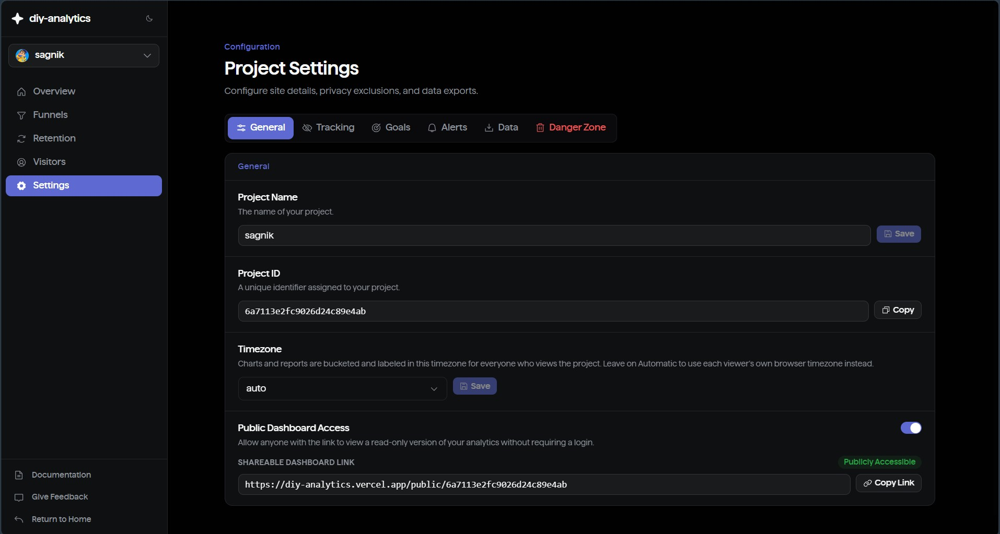

# Integration Guide

Everything here is about getting data *into* diy-analytics: installing the
tracking script, sending custom events and errors, authorizing the domains
you deploy to, and working through the common setup issues that come up
along the way. For what you can *do* with that data once it's flowing, see
[Features](features.md).

## 1. Get your tracking snippet

Every project has its own tracking code, generated when the project is
created. Find it under **Project → Settings → Tracking Snippet**:

```html
<script async defer src="https://your-instance.example.com/api/tracker.js?site-id=YOUR_SITE_ID"></script>
```

Replace `your-instance.example.com` with the domain of your DIY Analytics
deployment (`NEXT_PUBLIC_SITE_URL`). `YOUR_SITE_ID` is generated per project —
copy the exact snippet from Settings rather than assembling it by hand.



## 2. Install it

Paste the snippet into the `<head>` of every page you want tracked. The
script is under 2 KB, loads asynchronously, and does not block rendering.

### Plain HTML

```html
<head>
  <script async defer src="https://your-instance.example.com/api/tracker.js?site-id=YOUR_SITE_ID"></script>
</head>
```

### Next.js (App Router)

Add it to the root layout with `next/script` so it's present on every route:

```tsx
// app/layout.tsx
import Script from 'next/script';

export default function RootLayout({ children }: { children: React.ReactNode }) {
  return (
    <html lang="en">
      <body>
        {children}
        <Script
          src="https://your-instance.example.com/api/tracker.js?site-id=YOUR_SITE_ID"
          strategy="afterInteractive"
        />
      </body>
    </html>
  );
}
```

### React (Vite / Create React App)

Add the tag to `index.html` — it's a static script include, not an npm
package:

```html
<!-- index.html -->
<head>
  <script async defer src="https://your-instance.example.com/api/tracker.js?site-id=YOUR_SITE_ID"></script>
</head>
```

### Other frameworks (Vue, Svelte, WordPress, Webflow, …)

Add the same `<script>` tag anywhere it renders once per page load — your
framework's document head / custom-code / theme-header injection point. There
is no framework-specific SDK; the tracker is a single vanilla-JS file.

## 3. Domain authorization

The tracker only sends data if the page's hostname matches one of the
project's authorized domains — its primary URL, any **additional domains**
added under **Settings → Tracking**, or a subdomain of either. This is
useful when a site is reachable from more than one hostname, e.g. a
`*.vercel.app` preview URL you want to keep tracking alongside a custom
domain, or a staging subdomain.

Note the subdomain rule is one-directional: authorizing `example.com` also
authorizes `staging.example.com` automatically, but authorizing
`staging.example.com` does not authorize `example.com`. If you see `Domain
not authorized for tracking` in the browser console, add the exact
hostname the page is served from as an additional domain (or fix the
primary URL, if that's the one that's wrong) under **Settings → Tracking**.

## 4. Single-page apps

No extra setup is needed. The script patches `pushState` / `replaceState` and
listens for `popstate`, so client-side route changes are tracked as pageviews
automatically.

## 5. Custom events

Call `window.trackEvent(name, data)` from anywhere after the script has
loaded:

```js
window.trackEvent('signup_completed', { plan: 'pro' });
```

- `name` — a short string, used as the event name in the dashboard.
- `data` — optional. A plain object (serialized to JSON) or a primitive
  value. Keep it small and flat — property values are limited to what's
  useful for filtering/breakdowns, and payloads over 8 KB are replaced with a
  truncation marker server-side rather than partially stored.

Event names starting with `__` are reserved (used internally for Web Vitals)
— avoid that prefix for your own events.

## 6. Core Web Vitals

LCP, CLS, and INP are collected automatically via the browser's
`PerformanceObserver` API and reported when the page is hidden or unloaded.
No configuration is required, and they appear in the project's Web Vitals
panel.

## 7. Error tracking

Uncaught exceptions, unhandled promise rejections, and failed resource
loads are captured automatically once the tracking script is installed —
nothing extra to call. They show up under the project's **Errors** tab (see
[Features → Error tracking](features.md#error-tracking)).

To tag captured errors with a release (a version string, a git SHA,
whatever you use), set a global before the tracking script loads:

```html
<script>window.__DIY_RELEASE__ = "v1.4.2";</script>
<script async defer src="https://your-instance.example.com/api/tracker.js?site-id=YOUR_SITE_ID"></script>
```

There's no API call to "create" a release — it's just a tag read off that
global at the moment an error is captured, so it must be set before the
tracker script runs. Errors captured without it are grouped under "No
release" and can still be filtered normally.

## 8. Visitor opt-out

Three functions are exposed on `window` for building a cookie-consent /
opt-out control:

```js
window.optOutAnalytics();  // stop tracking this visitor, clear local session state
window.optInAnalytics();   // resume tracking
window.isOptedOut();       // boolean — current opt-out status
```

## 9. Excluding your own traffic

Under **Settings → Tracking** you can exclude your own IP address from
analytics, and exclude specific URL path patterns (e.g. `/admin/*`,
`/internal/*`) from ever being recorded — useful for staging routes or
internal tools that share a domain with the tracked site.

## 10. Public dashboards

Enabling **Public Dashboard Access** in a project's Settings exposes a
read-only, filterable dashboard at `/public/<projectId>` that requires no
login — useful for sharing metrics externally without granting workspace
access.

## 11. Querying data programmatically

Beyond the dashboard, every deployment also serves an [MCP](https://modelcontextprotocol.io)
endpoint at `/api/mcp`, so an AI assistant can query analytics, errors,
funnels, and more directly. See
[Features → MCP server & API keys](features.md#mcp-server--api-keys) for
how to create a key and connect a client.

## Troubleshooting

| Console message | Cause | Fix |
| --- | --- | --- |
| `Missing site-id parameter` | The script tag's `site-id` query param is missing or empty. | Copy the full snippet from Settings, don't edit the URL by hand. |
| `Invalid site-id` | The `site-id` doesn't match any project's tracking code. | Confirm the project still exists and the code wasn't regenerated. |
| `Domain not authorized for tracking` | The page's hostname isn't the project's primary URL, an additional domain, or a subdomain of either. | Add the exact hostname as an additional domain under **Settings → Tracking**, or fix the primary URL. |
| No data appears, no console errors | A Content Security Policy is blocking the request. | Add your DIY Analytics domain to `script-src` and `connect-src` in your CSP. |
